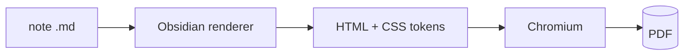
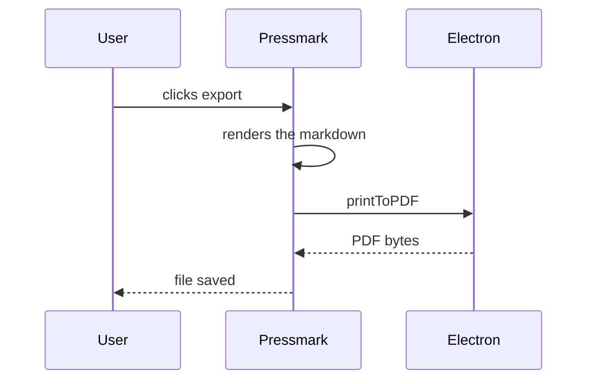
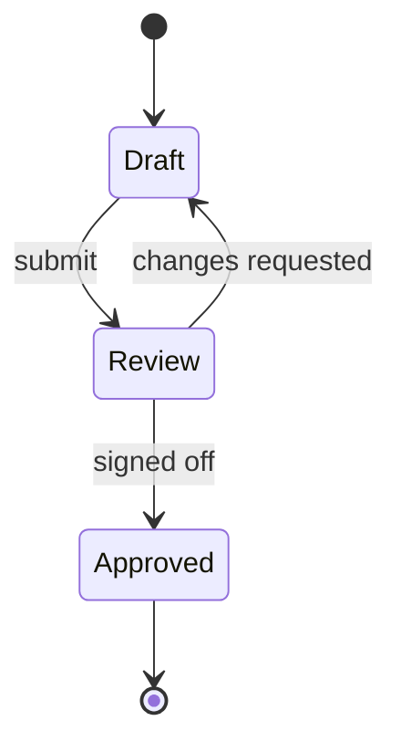
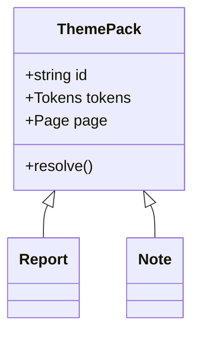
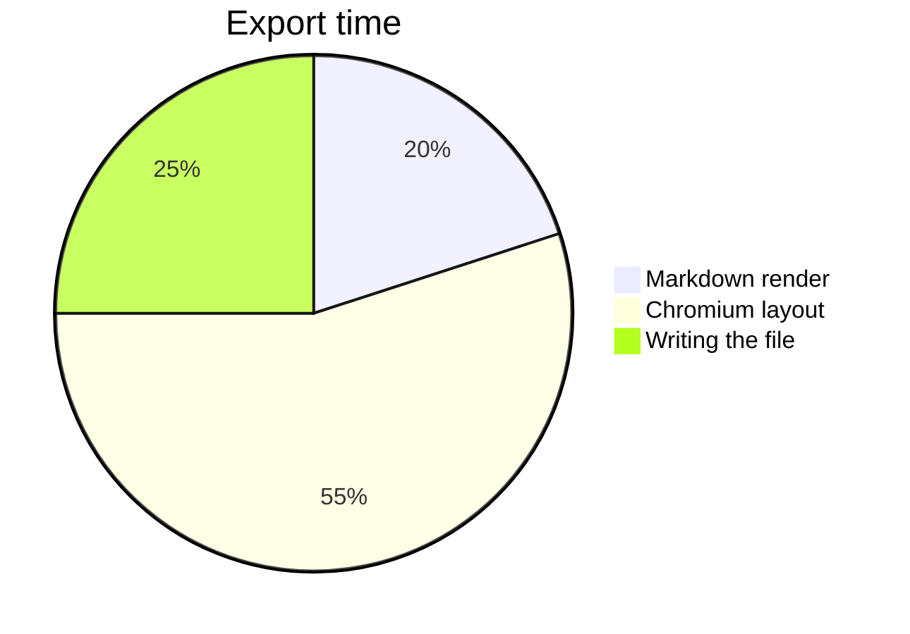

# Architecture and flows

**Purpose:** exercise every diagram type a document is likely to carry

---

## Export pipeline

## Sequence

## States

## Structure

## Where the time goes

## A wide one, on purpose

