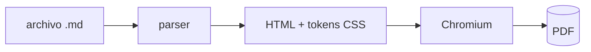

# Informe de conciliación trimestral

**Sistema:** Genesis PGW · **Período:** Q3 2026 · **Autor:** Equipo de Plataforma
**Estado:** Borrador para revisión · **Clasificación:** Uso interno

---

## Resumen

Este documento ejercita **todos** los elementos que el renderer debe resolver.
Existe para que el corpus golden detecte cualquier deriva entre el CLI y el
plugin. Si un elemento no aparece acá, no está cubierto.

Texto con *énfasis*, **peso**, `código inline`, ~~tachado~~ y un
[enlace externo](https://example.org).

## Tablas

El encabezado no lleva bloque de color: la jerarquía la da la regla del acento.

| Concepto              | Importe    | Δ vs Q2 | Estado     |
| --------------------- | ---------: | ------: | ---------- |
| Transacciones         | 1.284.902  |  +12,4% | Conciliado |
| Reversos              |     3.117  |  −2,1%  | Conciliado |
| Pendientes de cierre  |       842  |  +0,3%  | En revisión|
| **Total**             | **1.288.861** | **+12,3%** | — |

## Código

Bloque con resaltado:

```go
func (r *Renderer) PrintToPDF(ctx context.Context, opts PageOptions) ([]byte, error) {
    if err := r.waitForMermaid(ctx); err != nil {
        return nil, fmt.Errorf("mermaid no resolvió: %w", err)
    }
    return r.page.PrintToPDF(ctx, opts)
}
```

Sin lenguaje declarado:

```
$ pressmark report.md --theme executive
✓ report.pdf  (284 KB)
```

## Listas

1. Primer paso del proceso
2. Segundo paso
   - Anidado con viñeta
   - Otro anidado
3. Tercer paso

- [x] Tarea completada
- [ ] Tarea pendiente

## Cita

> El encabezado de tabla NO lleva bloque de color sólido. Un documento con seis
> tablas y seis franjas saturadas parece un formulario.

## Diagrama



## Salto de página forzado

<div style="break-after: page"></div>

## Contenido tras el salto

Párrafo que debe abrir en carilla nueva, para verificar que el pie de página
numera bien y que el margen superior se respeta en páginas interiores.

Definición con nota al pie[^1].

[^1]: Las notas al pie deben renderizar al final del documento, no de la página.
